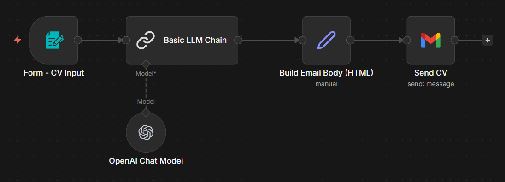
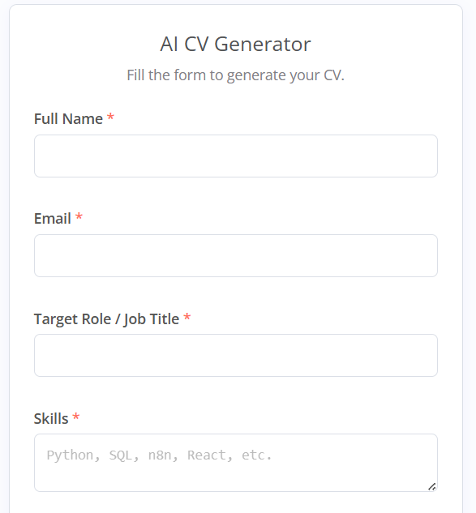
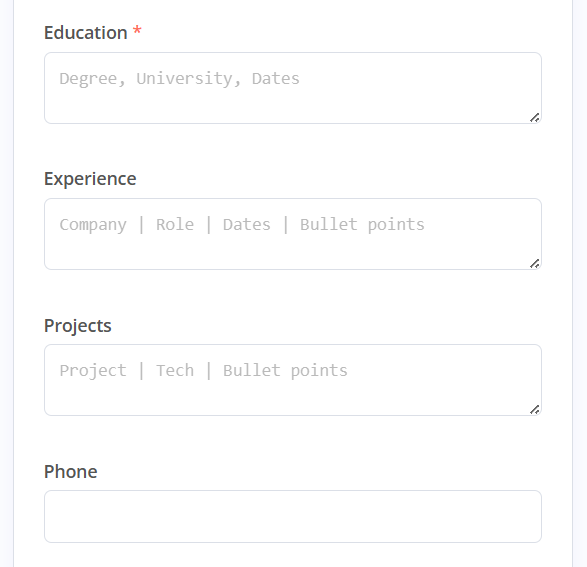
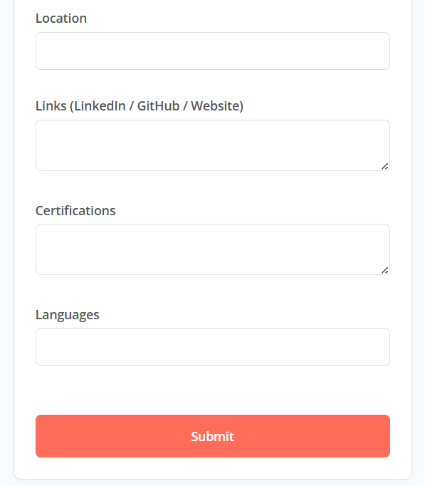
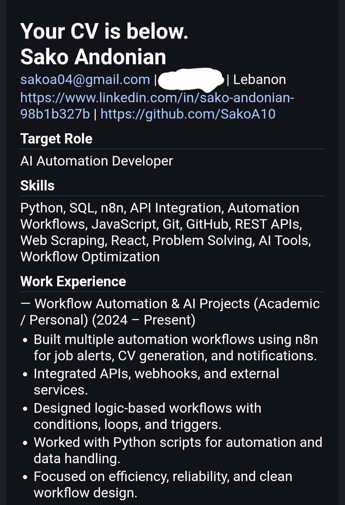
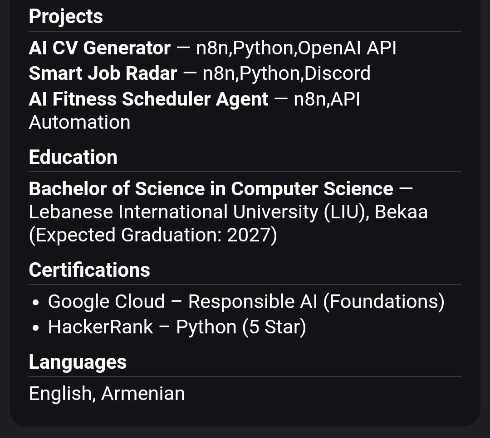

# AI CV Generator (n8n + OpenAI)

A real-world CV generator built with n8n and OpenAI.
The user fills a form, the AI cleans and improves the content (without inventing facts), and the CV is emailed automatically.

## What the AI Does

- Improves wording and fixes grammar (same meaning only)
- Never invents facts (no fake companies, roles, dates, or skills)
- Normalizes capitalization and removes weak/invalid skills

## Workflow Overview

## CV Form

## Email Result

## Tech Stack

- n8n (localhost)
- OpenAI (Chat)
- Gmail API

## Notes

- Free-text inputs supported
- Missing data is omitted automatically
- Built for realism, not hallucinations
